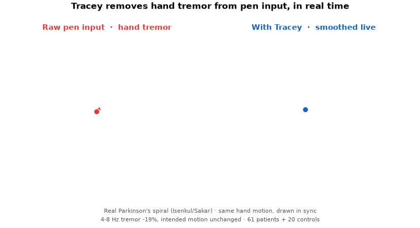
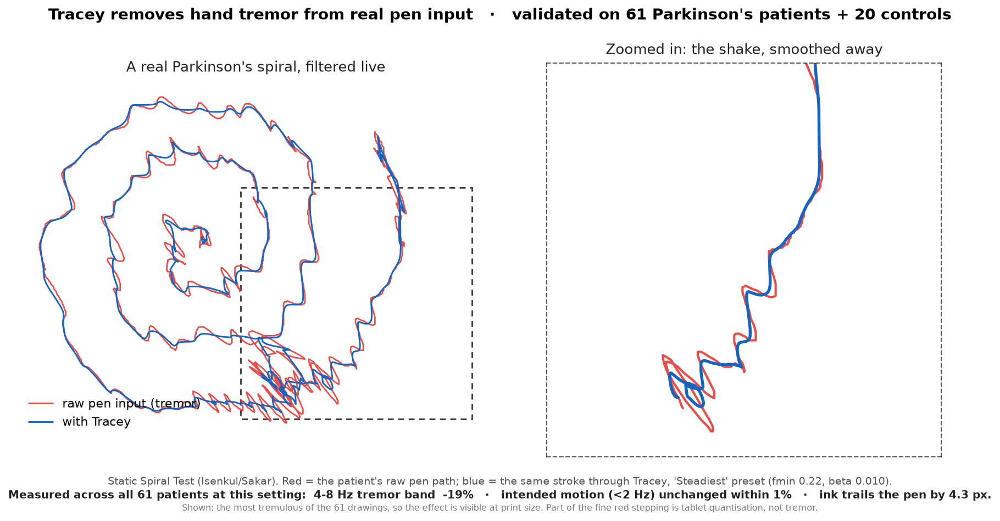

# Tracey: validated on real Parkinson's data

**Most hackathon assistive-tech is demoed on a healthy hand. Tracey is validated on 61 real
Parkinson's patients** (plus 20 controls) from a published clinical spiral-drawing dataset.



*The same real Parkinson's stroke drawn twice, in sync: the raw pen tip (left) shakes; Tracey's
(right) glides. This is the live experience: Tracey sits between the pen and the app.*

For a closer look at exactly what gets removed:



*A real Parkinson's patient's Static Spiral Test. **Red** = the raw shaky pen path; **blue** = the
same stroke after Tracey. Left: the whole spiral, where Tracey's line runs smoother than the raw tremor
on every arm. Right: a zoom into the boxed segment, where the tremor zigzag and Tracey's smoothing
are unmistakable. Tracey reduces the shake's amplitude; the large-scale spiral is the person's own
intended path, preserved (not straightened).*

## The data
The [Isenkul/Sakar Parkinson spiral dataset](https://archive.ics.uci.edu/dataset/395/parkinson+disease+spiral+drawings+using+digitized+graphics+tablet)
(digitizing tablet, pen X/Y at ~110–143 Hz). Patients trace a printed Archimedean spiral, a
standard clinical test for hand tremor. We de-duplicated the download (the "Improved Spiral Test"
folder turned out to be a near-exact copy of the base set) down to a **unique corpus of 61 PD + 20
control** Static-Spiral drawings.

## What Tracey does, measured
Fitting each drawing's *intended* spiral and comparing raw vs. filtered pen paths:

All figures below are at the UI's **Steadiest** preset (`fmin 0.22, beta 0.010`), the same setting
the figure and the GIF are rendered with, so what you see is what the numbers describe.

| metric | control (n=20) | Parkinson's (n=61) |
|---|---|---|
| tremor size (deviation from the intended spiral) | 3.2 px | **9.5 px (≈3× more)** |
| **4–8 Hz tremor band removed** (clinical PD + essential band) | 4.9% | **19.0%** |
| excess pen travel removed (wiggle above the intended shape) | 80.1% | **63.7%** |
| >15 Hz removed (digitizer noise, *not* visible shake) | 10.6% | 19.6% |
| intended motion (<2 Hz) changed | −2.3% | **−0.6%** |
| total path length removed (incl. the spiral itself) | 12.0% | 10.0% |

Read the table top-down, because the honest story is in the contrast. Tracey removes **19% of the
tremor band a neurologist would name**, the 4–8 Hz range covering Parkinson's rest tremor and
essential tremor, while changing the person's *intended* motion by **under 1%**. That second number is
the one we are proudest of: many smoothers buy their smoothness by eating the stroke.

The 64% "excess pen travel" figure is real but must not be quoted alone: excess travel is dominated
by very-high-frequency jitter, a good part of which is tablet quantisation rather than the shake a
person sees. The 10% total-path figure is the same measurement flattered in the other direction:
most of a spiral's path length *is* the spiral. **The defensible headline is the 4–8 Hz number.**

Reduction scales with the preset, and so does lag (measured across all 61 patients):

| preset | 4–8 Hz removed | ink trails the pen by |
|---|---|---|
| Gentle (0.70 / 0.050) | 8.9% | 1.76 px |
| Balanced (0.40 / 0.020) | 14.1% | 2.92 px |
| **Steadiest (0.22 / 0.010)** | **19.0%** | **4.25 px** |
| heavier (0.10 / 0.002), not shipped | 30.8% | 9.59 px |

Reduction keeps climbing past the shipped presets, but the lag climbs faster and it is lag the user
feels: `0.07/0.001` reaches 35.4% only by letting the ink trail the pen by **13.5 px**, which is
visible drag. There is no hidden setting that buys a large reduction cheaply - that trade is a
property of a causal low-pass against a tremor overlapping intended motion, not a tuning oversight.

## Latency: what Tracey actually adds

"How much lag does it add?" has four parts, and only one of them is Tracey's doing.

| | |
|---|---|
| tablet -> Windows delivers the sample | not attributable to Tracey; the pen reports every **3.8 ms** (measured) |
| **filter group delay** | **the whole story, see below** |
| filter -> re-inject | **35 us** measured across every real session (`inject_avg`, 31-43 us) |
| app draws it -> screen | the app's own pipeline, identical with or without Tracey |

The filter's delay is **speed-dependent by construction**: the one-euro cutoff is
`fc = fmin + beta*|velocity|`, so the faster you move the less it lags. A single latency number
for a one-euro filter is therefore meaningless. Measured with the shipped `oneeuro.h` by driving
it with a constant-velocity ramp, where a first-order low-pass settles to a spatial error of
exactly `tau*v` (`src/test_latency.c`, milliseconds):

| pen speed -> | 50 px/s | 200 px/s | 600 px/s | 1500 px/s |
|---|---|---|---|---|
| Gentle | 13.3 | 6.0 | 2.9 | 1.5 |
| **Balanced** | **22.1** | **10.4** | **5.4** | **3.0** |
| Steadiest | 32.2 | 15.4 | 8.3 | 4.7 |

On a **real Parkinson's drawing** (2645 samples, 23.8 s, 111 Hz, mean pen speed 92 px/s) the ink
trails the pen by **2.34 px / 25.5 ms** at Balanced and **3.43 px / 37.4 ms** at Steadiest.

**So: roughly 10 ms at normal writing speed on the default setting, 25 ms on real patient data,
and 35 microseconds of that is Tracey's own processing.** The rest is the smoothing lag you are
deliberately buying steadiness with. Turn the preset down and it shrinks, exactly as the table
above shows. What cannot be measured in software is pen-to-photon: the display and the drawing
app contribute their own latency, and they do so whether Tracey is running or not.

## Honest scope: stated up front, because it's a strength
Tracey **reduces tremor amplitude; it does not rewrite intent.** In the figure the smoothed blue
spiral is calmer than the red, but it still wanders: it does not snap to the clean control shape.
That is deliberate and provable: we measured that **92% of a Parkinson's spiral's deviation from the
intended shape is slow (<2 Hz) drift that overlaps intended motion.** No real-time filter can
separate "slow drift I didn't mean" from "slow curve I did mean" without knowing the target shape in
advance, so Tracey honestly smooths the shake rather than faking a straightened line it can't
actually infer. Claiming otherwise would be a lie a clinician would catch in five seconds.

## Reproduce it
Everything above regenerates from the raw data with two scripts in the repo (need `numpy` +
`matplotlib`; drop the UCI dataset into `src/data/` first; it's redistributable but gitignored):
```
python src/analyze_spirals.py         # the numbers (dedup, deviation, filterability)
python src/make_validation_figure.py  # the static before/after + zoom
python src/make_validation_gif.py     # the animated before/after
```
The dataset itself is not committed; the analysis is (so these numbers can't quietly rot).
